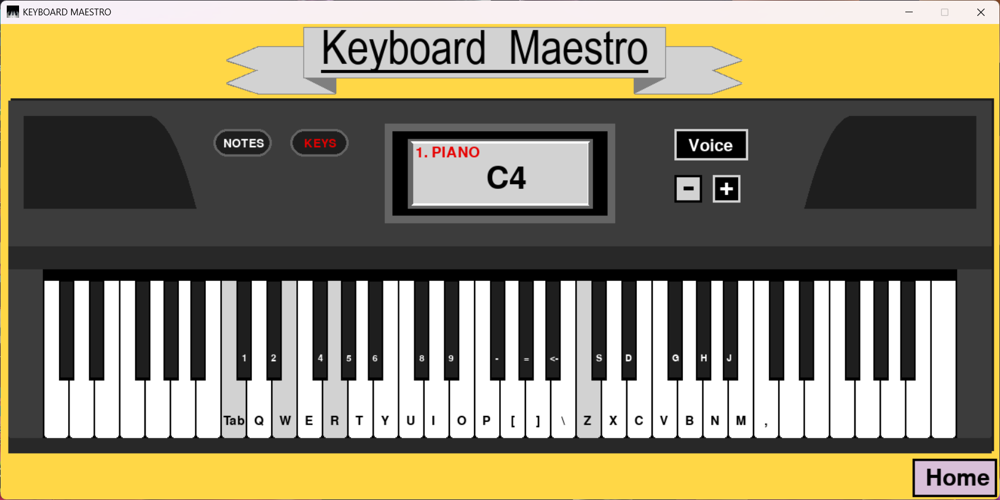
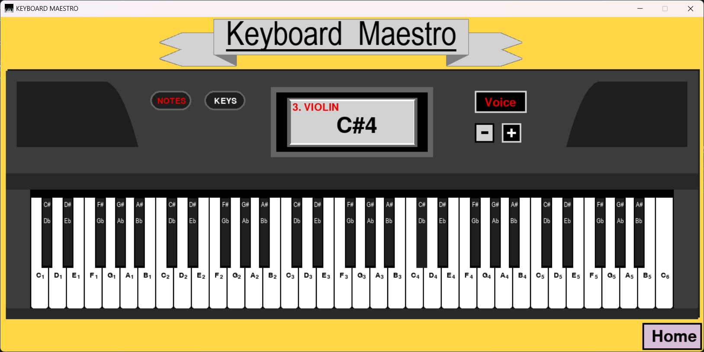
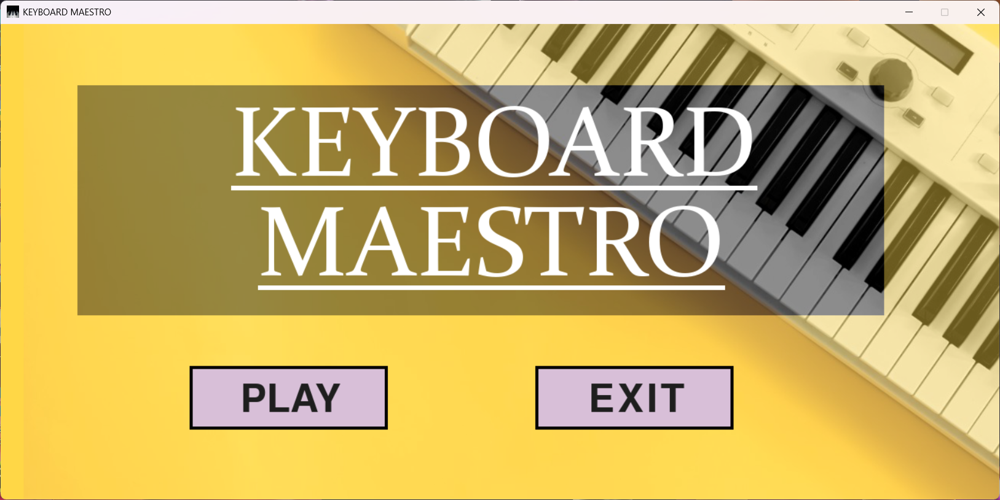

# 🎹 Keyboard Maestro

A fully functional virtual piano application with multiple instrument voices, built using Python and Pygame.

## 📖 About

Keyboard Maestro is a complete virtual piano that allows you to play music using your computer keyboard or mouse. The application features 61 playable keys spanning multiple octaves, three different instrument sounds, and a polished retro-styled interface.

**Project Timeline**: Developed during 11th-12th grade (2021-2022)  
**Recognition**: Best Computer Project Award in college

This project was built entirely from scratch, including recording all instrument sounds individually using a physical keyboard and sound equipment.

## ✨ Features

- 🎵 **61 Playable Keys** - Full piano keyboard with 5+ octaves (C1 to C6)
- 🎸 **3 Instrument Voices** - Switch between Piano, Saxophone, and Violin
- ⌨️ **Dual Input** - Play using keyboard keys or mouse clicks
- 🎨 **Visual Feedback** - Keys light up when pressed
- 📝 **Note Display** - Real-time display of the note being played
- 🔤 **Key Labels** - Toggle display of keyboard mappings and note names
- 🎭 **Retro Design** - Vintage-inspired interface with speakers and display screen
- 🎤 **Custom Audio** - All instrument sounds recorded and processed personally

## 🎮 Controls

### Keyboard Layout

#### White Keys (Natural Notes)
- **Octave 2**: `Tab` `Q` `W` `E` `R` `T` `Y`
- **Octave 3**: `U` `I` `O` `P` `[` `]` `\`
- **Octave 4**: `Z` `X` `C` `V` `B` `N` `M` `,`

#### Black Keys (Sharps/Flats)
- **Octave 2**: `1` `2` `4` `5` `6`
- **Octave 3**: `8` `9` `-` `=` `Backspace`
- **Octave 4**: `S` `D` `G` `H` `J`

### Interface Buttons
- **NOTES** - Toggle note name display on keys
- **KEYS** - Toggle keyboard mapping display
- **Voice** - Enable voice switching
- **+/-** - Cycle through instruments (when Voice is enabled)
- **Home** - Return to main menu

## 🚀 Installation

### Prerequisites
- Python 3.7 or higher
- pip (Python package installer)

### Steps

1. **Clone the repository**
```bash
   git clone https://github.com/vkShaun/keyboard-maestro.git
   cd keyboard-maestro
```

2. **Install required packages**
```bash
   pip install -r requirements.txt
```

3. **Run the application**
```bash
   python main.py
```

## 📁 Project Structure
```
keyboard-maestro/
│
├── main.py                    # Main application file
├── requirements.txt           # Python dependencies
├── screenshot1.png             # Main interface screenshots
├── screenshot2.png           
├── screenshot-home.png        # Home screen screenshot
│
├── images/
│   ├── piano bg.jpg          # Home screen background
│   └── pianologo.jpg         # Application icon
│
└── sounds/
    ├── Piano/
    │   ├── PianoA1.wav
    │   ├── PianoA2.wav
    │   ├── PianoBb1.wav
    │   └── ...               # All piano notes (C1-C6)
    │
    ├── Saxophone/
    │   ├── SaxophoneA1.wav
    │   ├── SaxophoneA2.wav
    │   ├── SaxophoneBb1.wav
    │   └── ...               # All saxophone notes (C1-C6)
    │
    └── Violin/
        ├── ViolinA1.wav
        ├── ViolinA2.wav
        ├── ViolinBb1.wav
        └── ...               # All violin notes (C1-C6)
```

## 🛠️ Built With

- **Python 3.x** - Programming language
- **Pygame** - Game development library for graphics and audio
- **Pygame Mixer** - Audio playback system

## 🎤 Audio Production

All instrument sounds in this project were recorded manually:
- Recorded each individual note (C1 through C6) for all three instruments
- Used a physical keyboard and professional sound recording equipment
- Processed and optimized audio files for consistent playback quality
- Total of 100+ individual sound files created

## 📸 Screenshots

### Main Piano Interface




### Home Screen



## 💡 Technical Highlights

- **Event-driven architecture** for handling keyboard and mouse input
- **State management** for tracking multiple simultaneous key presses
- **Audio streaming** with proper fadeout for smooth sound transitions
- **Responsive UI** with real-time visual feedback
- **Modular design** separating UI rendering, input handling, and audio playback

## 🏆 Recognition

- **Best Computer Project Award** - College level competition (2021-2020)

## 📝 License

This project is licensed under the MIT License - see the [LICENSE](LICENSE) file for details.

## 👤 Author

**Shaun Vivek Karkada**
- GitHub: [vkShaun](https://github.com/vkShaun)

---

*This project represents early work from high school and is being archived as part of my development portfolio.*
